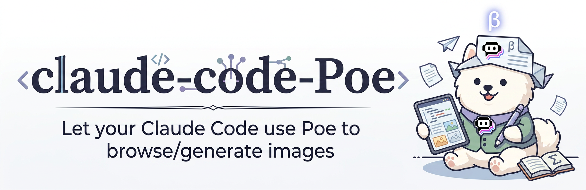

# Poe

**Use Poe inside Claude Code for web search, fresh information, and image generation**

`Poe` is a Claude Code skill for people who want Poe to handle search-backed lookups, current-information tasks, and text-to-image requests from one repo-local setup.

  
  
  
  

  <a href="README-zh.md"><b>中文说明</b></a> ·
  <a href="#what-this-does"><b>What this does</b></a> ·
  <a href="#use-it-for"><b>Use cases</b></a> ·
  <a href="#quick-start"><b>Quick start</b></a> ·
  <a href="#limits"><b>Limits</b></a>

## What this does

- Routes search and current-information tasks through Poe Responses API with `web_search_preview`
- Routes ordinary Poe chat tasks through Poe chat completions
- Uses the repo's `config.json` at runtime
- Asks the user to fill `api_key` and `image_download_dir` before requests that need them
- Downloads generated images to the exact directory configured in `config.json`

## Use it for

- "Use Poe to look this up"
- "Find the latest Claude Code docs"
- "Search today's AI news with Poe"
- "Generate an image with Poe"
- "Help me set up Poe config"

## Quick start

1. Put this skill in your Claude Code skills directory.
2. Open `config.json` in this folder.
3. Fill in `api_key`.
4. Fill in `image_download_dir` if you want image downloads.
5. Start using Poe-related prompts in Claude Code.

- Local access: your local environment must be able to reach Poe. If needed, connect through a VPN first.
- Troubleshooting: if Poe still does not work, the usual causes are a missing or incorrect `api_key`, or path issues around the config file or output directory.

## What it asks from you

Before the first request, this skill expects you to edit `config.json`.

Fields that already have defaults:
- `base_url`
- `default_text_model`
- `default_search_model`
- `default_image_model`

Fields you need to fill:
- `api_key`
- `image_download_dir`

The skill should read this repo's `config.json` before every Poe request and use exactly the `api_key` stored there.

## What it produces

Depending on the task, this skill returns:
- a Poe search answer with citations when Poe provides them
- a Poe text response with the model used
- generated image files saved to the configured local directory

## Limits

- It does not use Claude Code `WebSearch` for current-information tasks.
- It stops if `config.json` is missing or `api_key` is empty.
- It stops image download tasks if `image_download_dir` is empty.
- It should not be used to store real secrets anywhere except the local `config.json` that the user edits.

## File map

- `skill.md`: skill rules and execution flow
- `config.json`: runtime config template
- `README.md`: English README
- `README-zh.md`: Chinese README

## Design choices

- Poe search is the default path for current information.
- Repo-local `config.json` is the only config source for runtime requests.
- The skill asks for missing setup instead of silently falling back.
